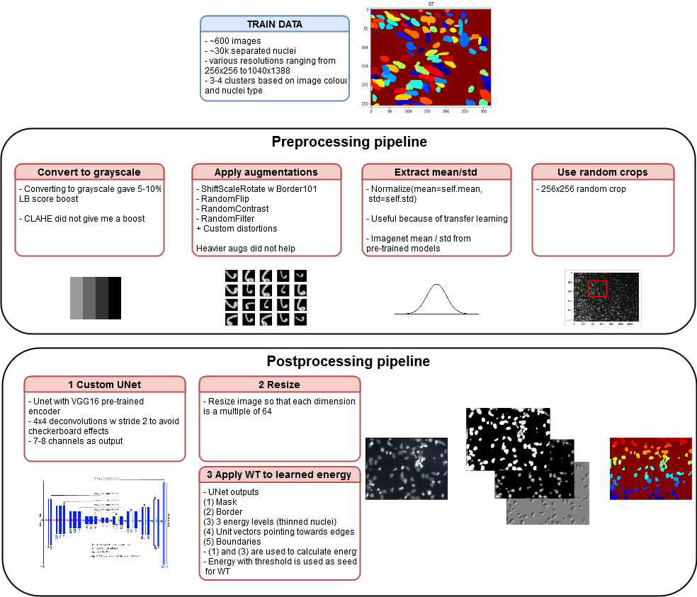
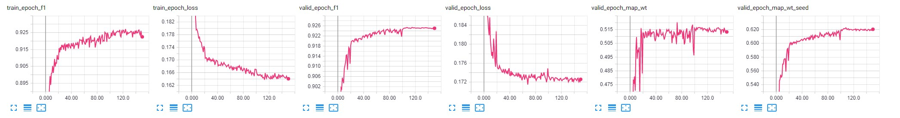

**More stuff from us**
- [Telegram](https://t.me/snakers4) 
- [Twitter](https://twitter.com/AlexanderVeysov)
- [Blog](https://spark-in.me/tag/data-science)


# 0 Introduction

This is a [DWT-inspired](https://arxiv.org/abs/1611.08303) solution to the Kaggle's 2018 [DS Bowl](https://www.kaggle.com/c/data-science-bowl-2018/) I produced within approximately 1 week before the end of the compeititon.

**UPDATE 2018-04-22** - my score was 114th. I guess they are cleaning the LB in the end.

**UPDATE 2018-04-24** - found out why my model generalized poorly - I forgot to re-create `optimizer` after unfreezing the encoder weights.

Most prominently it features a dockerized PyTorch implementation of approach similar to Deep Watershed Transform.

Since the target metric was highly unstable (average mAP on 0.5 - 0.95 thresholds) and the private LB contained data mostly not related to the train dataset, it's a bit difficult to evaluate code performance, but it's safe to say that:
- The performance is for single model on one fold;
- ~400th place in stage 1 LB and ~100th place in stage 2 LB (most likely the position will rise, since the LB is not finalized yet);
- I did not invest time in ensembling / folding / annotation etc because I entered late and it was obvious that second stage would be a gamble given the quality of the dataset and organization;

Key take-aways:
- People have reported that VGG based models overfitted heavily on train/val and heavy Resnet models (e.g. Resnet152) were key. I did not test heavy Resnets, so it's very likely that performance can be impoved greatly;
- Top solutions also featured learning 2 masks - gt mask + a boundary BETWEEN nuclei;
- DWT / energy greatly helps - it gave ~0.07-0.09 mAP locally and ~0.05 - 0.07 on the LB;
- All other promising post-processing techniques (e.g. detecting centers of the nuclei with [blob_log](http://scikit-image.org/docs/dev/auto_examples/features_detection/plot_blob.html) and using them as additional energy level) did not work;
- The base model is very powerful, but probably prone to overfitting due to dataset being of very low quality;
- Dataset curation / balancing / proper annotation - matters more than a particular architecture in this case;




# 1 Hardware requirements

**Training**

- 6+ core modern CPU (Xeon, i7) for fast image pre-processing (in this case distance transform takes some time for each nuclei);
- The models were trained on 2 * GeForce 1080 Ti;
- Training time on my setup ~ **6-8 hours** per one fold;
- Disk space - 10GB should be more than enough, ~20GB for building a docker image;

**Inference**

- 6+ core modern CPU (Xeon, i7) for fast image pre-processing;
- On 2 * GeForce 1080 Ti inference takes **1-2 minutes** for the public test dataset (65 images);

# 2 Preparing and launching the Docker environment

**Clone the repository**

`git clone https://github.com/snakers4/ds_bowl_2018 .`


**This repository contains a Dockerfile used when training models**
- `/dockerfiles/Dockerfile` - this is the main Dockerfile


**Build a Docker image**

```
cd dockerfiles
docker build -t bowl_image .
```

**Install the latest nvidia docker**

Follow instructions from [here](https://github.com/NVIDIA/nvidia-docker).
Please prefer nvidia-docker2 for more stable performance.


To test all works fine run:


`docker run --runtime=nvidia --rm nvidia/cuda nvidia-smi`

**(IMPORTANT) Run docker container (IMPORTANT)**

Unless you use this exact command (with --shm-size flag) (you can change ports and mounted volumes, of course), then the PyTorch generators **WILL NOT WORK**. 


- nvidia-docker 2: `docker run --runtime=nvidia -e NVIDIA_VISIBLE_DEVICES=all -it -v /path/to/cloned/repository:/home/keras/notebook -p 8888:8888 -p 6006:6006  --shm-size 16G bowl_image`
- nvidia-docker: `nvidia-docker -it -v /path/to/cloned/repository:/home/keras/notebook -p 8888:8888 -p 6006:6006  --shm-size 8G aveysov`


**To start the stopped container**


`docker start -i YOUR_CONTAINER_ID`


# 3 Preparing the data and the machine for running scripts

- Ssh into the docker container via `docker exec -it YOUR_CONTAINER_ID`
- Cd to the root folder of the repo
- Dowload the data into `data/`
- Note that `data\` already contains pickled train dataframes with meta-data (for convenience only)
- If kaggle removes the data download links from the competition page, you can download the data from [here](https://drive.google.com/open?id=1uRO3elNqVVxeWpU8hsCn0tRP_YAtGkql)

    
After all of your manipulations your directory should look like this (omitting csv files):

```
├── README.md          <- The top-level README for developers using this project.
├── data
│   ├── stage1_test                 <- A folder with stage1 test data
│   ├── stage2_test                 <- A folder with stage2 test data
│   ├── test_df_stage1_meta         <- A pickled dataframe with stage1 test meta data
│   ├── train_df_stage1_meta        <- A pickled dataframe with stage1 train meta data
│   └── stage1_train                <- A folder with stage1 train data
│       ├─ f8e74d4006dd68c1dbe68df7be905835e00d8ba4916f3b18884509a15fdc0b55
│       │  ├──  images
│       │  └──  masks

        ...
        

│       └─ ff599c7301daa1f783924ac8cbe3ce7b42878f15a39c2d19659189951f540f48
│
├── dockerfiles                               <- A folder with Dockerfiles
│
└── src                                       <- Source code
```


# 4 Training the model

You see the list of the available model presets in `src/models/model_params.py`

The best model according to my tests was Unet16 (Unet + Vgg16 pre-trained encoder)

If all is ok, then use the following command to train the model

- Ssh into the docker container via `docker exec -it YOUR_CONTAINER_ID`
- Cd to the root folder of thre repo
- `cd src`
- optional - turn on tensorboard for monitoring progress `tensorboard --logdir='ds_bowl_2018/src/tb_logs --port=6006` via jupyter notebook console or via tmux + docker exec (model converges in 100-150 epochs)
- then for example train on 2 folds

```
echo 'python3 train_energy.py \
	--arch unet16_160_7_dc --epochs 150 --workers 10 \
	--channels 7 --batch-size 12 --fold_num 0 \
	--lr 1e-3 --optimizer adam \
	--bce_weight 0.9 --dice_weight 0.1 --ths 0.5 \
	--print-freq 1 --lognumber unet16_160_7_dc_ths5_energy_distance_gray_final \
	--tensorboard True --tensorboard_images True --is_distance_transform True --is_boundaries True \
	--freeze True \

python3 train_energy.py \
	--arch unet16_160_7_dc --epochs 150 --workers 10 \
	--channels 7 --batch-size 12 --fold_num 1 \
	--lr 1e-3 --optimizer adam \
	--bce_weight 0.9 --dice_weight 0.1 --ths 0.5 \
	--print-freq 1 --lognumber unet16_160_7_dc_ths5_energy_distance_gray_final \
	--tensorboard True --tensorboard_images True --is_distance_transform True --is_boundaries True \
	--freeze True \' > train.sh
    
```
- `sh train.sh`


# 5 Making predictions / evaluation


- Ssh into the docker container via `docker exec -it YOUR_CONTAINER_ID`
- Cd to the root folder of the repo
- `cd src`
- then
``` 
echo 'python3 train_energy.py \
	--arch unet16_64_7_dc --channels 7 --batch-size 1 --ths 0.5 \
	--lognumber unet16_64_7_dc_ths5_energy_distance_gray_longer_rerun \
	--workers 0 --predict' > predict.sh
```
- `sh predict.sh`
- note that the `lognumber` is the lognumber you specified when training
- please check which fold is used in the prediction loop

- You can also run evaluation-only scripts like this
```
python3 train_energy.py \
    --evaluate \
    --resume weights/unet16_160_7_dc_ths5_energy_distance_gray_final_fold2_best.pth.tar \
	--arch unet16_160_7_dc --epochs 50 --workers 10 \
	--channels 7 --fold_num 2 \
	--ths 0.5 --is_distance_transform True --is_boundaries True \
	--print-freq 10 --lognumber eval_validation --tensorboard_images True \
```

# 6 Watershed

- The model is analogous to DWT since it uses predicted energy for watershed;
- The best performing wateshed post-processing scripts is in `utils.watershed.energy_baseline`;
- All the other functions in `utils.watershed` performed worse;


# 6 Additional notes


- The model randomly crops images when training and resizes them when predicting;
- An unfinished `src/train_energy_pad.py` is also available. It works, but produces inferior quality;

    
# 7 Jupyter notebooks

Use these notebooks on your own risk!

- `src/bowl.ipynb` - general debugging notebook with new models / generators / etc
